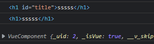

## 目录

*   [ref属性](#ref属性)

*   [父传子 props+v-bind](#父传子-propsv-bind)

*   [mixin混入](#mixin混入)

*   [ plugin插件](#-plugin插件)

*   [style scoped](#style-scoped)

# ref属性 父传子 mixin plugin scoped

## ref属性

`ref` 被用来给元素或子组件注册引用信息

```vue
      <h1 id="title">{{msg}}</h1>
      <h1 v-text="msg" ref="text"></h1>
      <button @click="showBtn">点击输出DOM</button>
      <School ref="school"></School>
  showBtn(){
      console.log(document.getElementById('title'))
      console.log(this.$refs.text)
      console.log(this.$refs.school)//Vue组件对象
    }
```



<https://cn.vuejs.org/v2/guide/components-edge-cases.html#访问子组件实例或子元素>

> 关于使用？？？？....

## 父传子 props+v-bind

```vue
  //三种props配置
    props:['name','age','sex'],
    //限制接受的参数类型
    props:{
        name:String,
        age:Number,
        sex:String
    },
    props:{
        name:{
            type:String,
            required:true
        },
        age:{
            type:Number,
            default:20
        }
    }
```

```vue
  //父组件节点
  <Student name="李四" sex="女" :age="19"></Student>
  //子组件
<template>
  <div>
    <h1>{{msg}}</h1>
    <h1>学生姓名:{{name}}</h1>
    <h1>学生性别:{{sex}}</h1>
    <h1>学生年龄:{{stuAge+1}}</h1>
    <button @click="addAge">点击增加年龄</button>
  </div>
</template>
<script>
export default {
    props:['name','age','sex'],
    data(){
        return{
            msg:'啊啊啊啊啊',
            stuAge:this.age
        }
    },
    methods:{
        addAge(){
            this.stuAge = this.age++
        }
    }
}
</script>

```

## mixin混入

使用混合，来分发 Vue 组件中的可复用功能

*   全局混入Vue.mixin(xxx)   在main.js中配置（不推荐）

```vue
import {mixin,mixin2} from '../mixin'
Vue.mixin(mixin,mixin2)
```

*   **局部混入**mixins:\['xxx']备注

```vue
//src/mixin.js
//内部对象需要暴露export
export const mixin = {
    data(){
        return{
            msg:'点击出信息'
        }
    },
    methods: {
        show(){
            console.log(this.name)
        },
       
    },
}
 const mixin2 = {
    methods: {
        showMsg(){
            alert(this.msg)
        }
    }
}
export default {mixin2,mixin}
//使用
import {mixin,mixin2} from '../mixin'
export default {
  mixins:[mixin,mixin2]
}
```

## &#x20;plugin插件

<https://cn.vuejs.org/guide/reusability/plugins.html>

```vue
//src/plugin.js
//包含install方法的一个对象，install的第一个参数是Vue，第二个以后的参数是插件使用者传递的数据
export default {
    install(Vue,x,y,z){
      console.log(x,y,z)
      //全局过滤器
      Vue.filter('mySlice', function(value){return value.slice(0,4)})
  
      //定义全局指令
      Vue.directive('fbind',{
        //指令与元素成功绑定时（一上来）
        bind(element,binding){element.value = binding.value},
        //指令所在元素被插入页面时
        inserted(element,binding){element.focus()},
        //指令所在的模板被重新解析时
        update(element,binding){element.value = binding.value}
      })
  
      //定义混入
      Vue.mixin({
        data() {return {x:100,y:200}},
      })
  
      //给Vue原型上添加一个方法（vm和vc就都能用了）
      Vue.prototype.hello = ()=>{alert('你好啊')}
    }
  }
  //使用
  import plugins from './plugins'
  Vue.use(plugins,1,2,3)//使用插件

```

## style scoped

局部样式，防止样式冲突

```vue
//默认是lang="css"
//使用less，需要安装插件less-loader
<style scoped lang="less">
.demo{
    background-color:aquamarine;
    .test{
        color:antiquewhite;
    }
}
</style>
```
