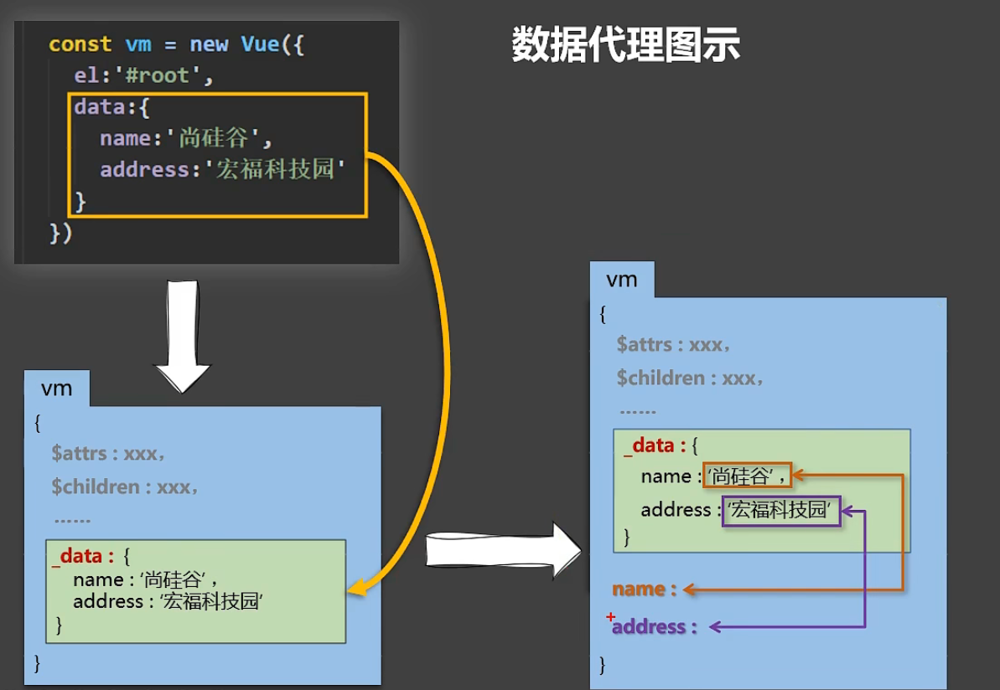

# 初识 MVVM 数据绑定

## 简介

中文官网

<https://cn.vuejs.org/>

Vue 是一套用来动态构建用户界面的渐进式JavaScript框架

*   **构建用户界面**：把数据通过某种办法变成用户界面

*   **渐进式**：Vue可以自底向上逐层的应用，简单应用只需要一个轻量小巧的核心库，复杂应用可以引入各式各样的Vue插件

### 特点

？

### 周边库

*   vue-cli：vue 脚手架

*   vue-resource(axios)：ajax 请求

*   vue-router：路由

*   vuex：状态管理（它是 vue 的插件但是没有用 vue-xxx 的命名规则）

*   vue-lazyload：图片懒加载

*   vue-scroller：页面滑动相关

*   mint-ui：基于 vue 的 UI 组件库（移动端）

*   element-ui：基于 vue 的 UI 组件库（PC 端）

## 初识VUE

1.  想让Vue工作，就必须创建一个Vue实例，且要传入个 配置对象;

2.  root容器里的代码依然符合html规范,只不过混入了一些特殊的Vue语法;

3.  root容器里的代码被称为\[Vue模板] ;

4.  Vue实例和容器是一对应的:&#x20;

5.  真实开发中只有一个Vue实例，并且公配合着组件一起使用;

6.  &#x20;{{xxx}}中的xx要写js表达式，且xxx可以自动读取到data中的所有属性;

7.  且data中的数据发生改变，那么模板中用到该数据的地方也会自动更新:

注意区分: js表达式和js代码(语句)

1.  表达式:个 表达式会产生一个值， 可以放在任何个需要值的地方:

    &#x20;a    a+b    demo(1)     x === y ? 'a': 'b'

2.  js代码(语句)

    &#x20;if(){}     for(){}

```html
<!-- 容器 -->
<div id="root">
  <h1>hello,{{name}},{{Date.now()}}</h1>
  <!-- {{ js表达式 }}插值语法 -->
</div>
<script>
    Vue.config.productionTip = false //阻止 Vue 再启动时产生生产提示
    //创建Vue实例
    const x = new Vue({
        el:'#root',//e1用于指定当前Vue实例为哪个容器服务，值通常为css选择器宁符串。
        // el:document.getElementById('root')
        data:{
            name:"名字"
        }
    })//new Vue()括号里 配置对象
</script>

```

第二种el写法

```html
<script>
    const x = new Vue({})
    setTimeout(()=>{
        v.$mount('#root')
    },1000)
</script>
```

第二种data写法

```html
<script>
    new Vue({
    //对象式
        // data:{
        //     name:"名字"
        // }
    //函数式
    //data:function(){}
        data(){
        console.log(this)//此处的this是Vue实例对象
            return{
                name:"名字"
            }
        }
    //若写成箭头函数=>，this获取到windows对象
    })
</script>

```

## 模板语法

*   插值语法

    `{{}}`

*   指令语法

## MVVM模型

M**模型(Model)** : data中的数据

V **视图(View)** :模板代码

VM **视图模型(ViewModel)**: Vue实例

Vue原型上所有属性，在Vue模板中都可以直按使用。


## 底层数据代理

&#x20;回顾es6的Object.defineProperty

1.Vue中的数据代理:

通过vm对象来代理data对象中属性的操作(读/写)

2.Vue中数据代理的好处:

更加方便的操作data中的数据

3.基本原理:

通过object . defineProperty( )把data对象中所有属性添加到vm上。

为每一个添加到vm 上的属性， 都指定个getter/setter.

在getter/setter内部去操作(读/写) data中对应的属性。

```html
<script>
    let number = 18
    let person = {
        name:'张三',
        sex:'男',
        // age:18 
    }

    //此时age属性不可被枚举
    // Object.defineProperty(person,'age',{
    //     value:18
    // })

    Object.defineProperty(person,'age',{
        // value:18,
        // enumerable:true,//控制属性是否可以被枚举
        // writable:true,//控制属性是否可以被修改
        // configurable:true//控制属性是否可以被删除 

        //当有人读取person的age属性时，get函数(getter)就会被调用，且返回值就是age的值
        get(){
            console.log('有人读取age属性了')
            return number
        },
        set(value){
            console.log('有人修改了age属性的值,且值是',value)
            number = value
        }

    })
    console.log(person)
</script>
```



```html
控制台
vm.name = "aaa"//触发了setter
vm._data
```

## 数据绑定

```html
单项数据绑定：<input type="text" v-bind:value="name">
<!-- v-model默认收集value值，只能应用在表单元素上 -->
双向数据绑定：<input type="text" v-model:value="name">
<!-- 简写 -->
<input type="text" :value="name">
<input type="text" v-model="name">

```
