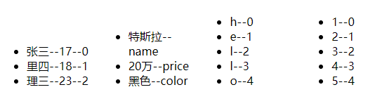

## 目录

*   [条件渲染v-show与v-if ](#条件渲染v-show与v-if-)

*   [列表渲染v-for](#列表渲染v-for)

*   [ vue中的key有什么作用](#-vue中的key有什么作用)

*   [列表过滤](#列表过滤)

*   [列表排序](#列表排序)

*   [API set ](#api-set-)

*   [响应式添加修改数据](#响应式添加修改数据)

# 条件渲染 列表渲染

## 条件渲染v-show与v-if&#x20;

```html
    <div id="root">
        <!-- v-show="false" 解析为 样式display:none -->
        <h2 v-show="false"> v-show </h2>
        <!--  v-if="false" 解析为 注释,不展示DOM元素直接被移除 -->
        <h2 v-if="n == 1">v-if</h2>
        <h2 v-else-if="n == 2">v-if</h2>
        <h2 v-else>v-if</h2>
        <!-- template不影响结构，只能使用v-if -->
        <template v-if="true">
            <div>
                测试测试
            </div>
        </template>
    </div>
```

## 列表渲染v-for

```html
        <!-- key标识 ，有id用id，无id使用索引index -->
        <ul>
            <!-- 遍历数字对象 index索引 -->
            <li v-for="(p,index) of persons" :key="p.id"> 
                {{p.name}}--{{p.age}}--{{index}}
            </li>
        </ul>
        <ul>
            <!-- 遍历对象 index是属性名 -->
            <li v-for="(a,index) of cars" > 
                {{a}}--{{index}} 
            </li>
        </ul>
        <ul>
            <!-- 遍历字符串 index索引 -->
            <li v-for="(a,index) of str" > 
                {{a}}--{{index}} 
            </li>
        </ul>
        <ul>
            <!-- 遍历指定次数 -->
            <li v-for="(num,index) of 5" > 
                {{num}}--{{index}} 
            </li>
        </ul>
```



## &#x20;vue中的key有什么作用

<https://blog.csdn.net/weixin_49320962/article/details/116277219?spm=1001.2101.3001.6650.3&utm_medium=distribute.pc_relevant.none-task-blog-2~default~CTRLIST~default-3-116277219-blog-121249710.pc_relevant_multi_platform_whitelistv1&depth_1-utm_source=distribute.pc_relevant.none-task-blog-2~default~CTRLIST~default-3-116277219-blog-121249710.pc_relevant_multi_platform_whitelistv1&utm_relevant_index=6>

## 列表过滤

```vue
<body>
    <div id="root">
        <input type="text" v-model="keyword"><br/>
        <!-- 包含空字符串 -->
        <ul>
            <li v-for="(p,index) of filPersons" :key="p.id">
            {{p.name}}-{{p.age}}
            </li>
        </ul>
    </div>
</body>
<script type="text/javascript">
  Vue.config.productionTip = false
  new Vue({
    el: '#root',
    data: {
        keyword:'',
        persons: [
            { id: '001', name: '林宇丽', age: 18 },
            { id: '002', name: '刘林华', age: 19 },
            { id: '003', name: '李华宇', age: 20 }
        ],
        filPersons:[]
    },
    watch: {
        keyword:{
            immediate:true,
            handler(val){
                this.filPersons = this.persons.filter((p)=>{
                    return p.name.indexOf(val) !== -1
                })
            }
        }
    },
  })
</script>
   //用computed实现
    data: {
        keyword:'',
        persons: [
            { id: '001', name: '林宇丽', age: 18 },
            { id: '002', name: '刘林华', age: 19 },
            { id: '003', name: '李华宇', age: 20 }
        ],
    },
    computed:{
        filPersons(){
            return this.persons.filter((p)=>{
                return p.name.indexOf(this.keyword) !== -1
            })
        }
    }
```

## 列表排序

```vue
<body>
    <div id="root">
        <input type="text" v-model="keyword">
        <button @click ="sortType = 1">年龄降序序</button>
        <button @click ="sortType = 0">原顺序</button>
        <button @click ="sortType = 2">年龄升序</button>
        <br/>
        <ul>
            <li v-for="(p,index) of filPersons" :key="p.id">
            {{p.name}}-{{p.age}}
            </li>
        </ul>
    </div>
</body>
<script type="text/javascript">
  Vue.config.productionTip = false
  new Vue({
    el: '#root',
    data: {
        keyword:'',
        sortType:0,
        persons: [
            { id: '001', name: '林宇丽', age: 23 },
            { id: '002', name: '刘林华', age: 19 },
            { id: '003', name: '李华宇', age: 20 }
        ],

    },
    computed:{
        filPersons(){
            const arr =  this.persons.filter((p)=>{
                return p.name.indexOf(this.keyword) !== -1
            })
            if(this.sortType){
                arr.sort((p1,p2)=>{
                    return this.sortType === 1 ? p2.age-p1.age : p1.age-p2.age
                })
            }
            return arr
        }
    }
  })
</script>
```

## API set&#x20;

特别注意：Vue.set() 和 vm.\$set() 不能给vm或vm的根数据对象（data等）添加属性

```vue
<button @click="addHobby">添加爱好</button>
    methods: {
        addHobby(){
            //使用Vue提供的set api 添加不存在的响应式属性，以下两种形式都可
            //(对象,属性名,数据)
            //注意对象不能为data
            this.$set(this.student,'school','林大')
            Vue.set(this.student,'school','林大')
        }
    },

```

## 响应式添加修改数据

Vue数据监视

1.  对象&&对象数组

    通过setter实现监视，且要在new Vue()时就传入要监测的数据

    对象创建后追加的属性，Vue默认不做响应式处理如需给后添加的属性做响应式，请使用如下API：

    *   `Vue.set(target,propertyName/index,value)`

    *   `vm.$set(target,propertyName/index,value)`

2.  数组

    触发视图更新：`push()`、`pop()`、`unshift()`、`shift()`、`splice()`、`sort()`、`reverse()`

    替换数组，会返回一个 新数组：`filter()`、`concat()` 和 `slice()`

    修改数组内某个元素值：使用set API

表单案例

```html
<body>
    <!-- 重新解析模板生成虚拟dom -->
    <div id="root">
        <button @click="student.age++">年龄加一岁</button><br><br>
        <button @click="addsex">添加性别属性，默认为男</button><br><br>
        <button @click="addFridend">在列表的首位添加一个朋友</button><br><br>
        <button @click="updateFriend">修改第一个朋友的名字为老五</button><br><br>
        <button @click="addHobby">添加一个爱好</button><br><br>
        <button @click="updateHobby">修改第一个爱好为：鸡你太美</button><br><br>
        <button @click="filterHobby">过滤掉篮球这个爱好</button>
        <h2>姓名：{{student.name}}</h2>
        <h2>年龄：{{student.age}}</h2>
        <h2>性别：{{student.sex}}</h2>
        <h2>爱好:</h2>
        <ul>
            <li v-for="(h,index) in student.hobby" :key="index">{{h}}</li>
        </ul>
        <h2>朋友:</h2>
        <ul>
            <li v-for="(f,index) in student.friends" :key="index">{{f.name}}+++{{f.age}}</li>
        </ul>
    </div>
</body>
<script type="text/javascript">
  Vue.config.productionTip = false
  const vm = new Vue({
    el: '#root',
    data: {
        student:{
            name:'I鲲',
            age:30,
            hobby:['唱','跳','rap','篮球'],
            friends:[
                {
                    name:'张三',
                    age:18
                },
                {
                    name:'李四',
                    age:23
                }
            ]
        }
    },
    methods: {
        addsex(){
            Vue.set(this.student,'sex','男')
        },
        addFridend(){
            this.student.friends.unshift(
                {
                    name:'李琦',
                    age:32
                }
            )
        },
        updateFriend(){
            this.student.friends[0].name = '老五'
        },
        addHobby(){
            this.student.hobby.push('偶像练习生')
        },
        updateHobby(){
            // this.student.hobby[0] = '鸡你太美'//对数组着这种方式dame
            Vue.set(this.student.hobby,0,'鸡你太美')
        },
        filterHobby(){
            this.student.hobby =  this.student.hobby.filter((h)=>{
                return h !== '篮球'
            })
        }
    },
  })
</script>
```
