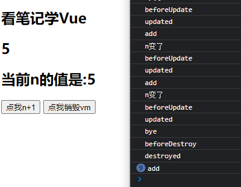

## 目录

*   [常用的生命周期钩子](#常用的生命周期钩子)

# 生命周期


```vue
<body>
    <div id="root">
        <h2 v-if="a">你好啊</h2>
        <h2 :style="{opacity}">看笔记学Vue</h2>
        <h2 v-text="n"></h2>
        <h2>当前n的值是:{{n}}</h2>
        <button @click="add">点我n+1</button>
        <button @click="bye">点我销毁vm</button>
    </div>
</body>
<script type="text/javascript">
  Vue.config.productionTip = false
  const vm = new Vue({
    el: '#root',
    data: {
      a: false,
      opacity: 1,
      n:1,
    },
    methods: {
      add(){
        console.log('add')
        this.n++
      },
      bye(){
        console.log('bye')
        this.$destroy()
        //完全销毁一个实例。清理它与其它实例的连接，解绑它的全部指令及事件监听器。
      }
    },
    watch:{
      n(){
        console.log('n变了')
      }
    },
    beforeCreate() {
      console.log('beforeCreate',this)
      // debugger
    },
    created() {
      console.log('created',this)
    },
    beforeMount() {
      console.log('beforeMount')
    },
    // Vue 完成模板的解析并把初始的真实 DOM 元素放入页面后（挂载完毕）调用 mounted
    mounted() {
      console.log('mounted', this)
      // setInterval(() => {
      //   this.opacity -= 0.01
      //   if(this.opacity <= 0) this.opacity = 1
      // }, 16)
    },
    beforeUpdate() {
      console.log('beforeUpdate')
    },
    updated() {
      console.log('updated')
    },
    beforeDestroy() {
      console.log('beforeDestroy')
    },
    destroyed() {
      console.log('destroyed')
    },
  })
  // 通过外部的定时器实现（不推荐）
  // setInterval(() => {
  //     vm.opacity -= 0.01
  //     if(vm.opacity <= 0) vm.opacity = 1
  // },16)
</script>
```



注：销毁后自定义事件会失效，但原生DOM事件依然有效。如图add点击事件

## 常用的生命周期钩子

*   mounted：发送ajax请求、启动定时器、绑定自定义事件、订闽消息等\[初始化操作]

*   beforeDestroy：清除定时器、解绑自定义事件、取消订阅消息等\[收尾工作]

```vue
<body>
    <div id="root">
        <h2 :style="{opacity}">看笔记学Vue</h2>
        <button @click="bye">点我销毁vm</button>
    </div>
</body>
<script type="text/javascript">
  Vue.config.productionTip = false
  const vm = new Vue({
    el: '#root',
    data: {
      opacity: 1,
    },
    methods: {
      bye(){
        console.log('bye')
        this.$destroy()
      }
    },
    mounted() { 
        this.timer = setInterval(() => {
        console.log('setInterval')
        this.opacity -= 0.01
        if(this.opacity <= 0) this.opacity = 1
      }, 16)
    },
   
    beforeDestroy() {
        clearInterval(this.timer)
    },
  })
</script>
```
