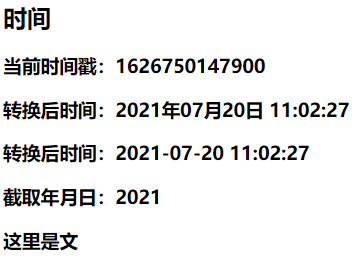

## 目录

*   [v-model的三个修饰符](#v-model的三个修饰符)

*   [过滤器](#过滤器)

# 表单提交 过滤器

## v-model的三个修饰符

`lazy`  失夫焦点再收集数据
`number`  输入字符串转为有效的数字
`trim` 输入首尾空格过滤

```html
<body>
    <div id="root">
      <!-- @submit.prevent给form绑定提交事件，阻止默认事件 -->
        <form @submit.prevent="demo">
            <label for="num">账号：</label>
            <input type="text" id="num" v-model.trim="userInfo.account">
            <br><br>
            <label for="pwd">密码：</label>
            <input type="password" id="pwd" v-model="userInfo.pwd">
            <br><br>
            年龄：
            <input type="number" v-model.number="userInfo.age">
            <br><br>
            性别：
            <input type="radio" name="sex" v-model="userInfo.sex" value="male">男
            <input type="radio" name="sex" v-model="userInfo.sex" value="female">女
            <br><br>
            爱好：
            <input type="checkbox" value="sing" v-model="userInfo.hobby">唱
            <input type="checkbox" value="dance" v-model="userInfo.hobby">跳
            <input type="checkbox" value="rap" v-model="userInfo.hobby">rap
            <br><br>
            所属校区：
            <select v-model="userInfo.city">
              <option value="">请选择校区</option>
              <option value="beijing">北京</option>
              <option value="shanghai">上海</option>
            </select>
            <br><br>
            其他信息：
            <textarea name="" id="" cols="30" rows="10" v-model.lazy="userInfo.other"></textarea>
            <br><br>
            <input type="checkbox" name="" id="" v-model="userInfo.agree">阅读并接受
            <a href="https://www.baidu.com">《用户协议》</a>
            <button>提交</button>
            <!-- 
              <button>提交</button>  默认type为submit 相当于<input type=“submit”> 点击就会立刻提交表单
              <button type="button">提交</button>  相当于<input type="button">  变为普通点击按钮
              提交表单会刷新界面，清空表单中的值
             -->
        </form>
    </div>
</body>
<script type="text/javascript">
  Vue.config.productionTip = false
  const vm = new Vue({
    el: '#root',
    data: {
      userInfo:{
        account:'',
        pwd:'',
        age:'',
        sex:'',
        hobby:[],
        city:'',
        other:'',
        agree:''
      }
    },
    methods: {
      demo(){
        console.log(JSON.stringify(this.userInfo))
      }
    },
  })
</script>
```

## 过滤器

可被用于一些常见的文本格式化

注册过滤器：

*   全局过滤器`Vue.filter(name, callback)`

*   局部过滤器`new Vue {filters: {}} `

使用过滤器：`{{ xxx | 过滤器名}} `或` v-bind:属性 = "xxx | 过滤器名"`

备注：

过滤器可以接收额外参数，多个过滤器也可以串联

并没有改变原本的数据，而是产生新的对应的数据

```html
<script src="https://cdn.bootcdn.net/ajax/libs/dayjs/1.10.6/dayjs.min.js"></script>
  <body>
    <div id="root">
      <h2>时间</h2>
      <h3>当前时间戳：{{time}}</h3>
      <h3>转换后时间：{{time | timeFormater()}}</h3>
      <h3>转换后时间：{{time | timeFormater('YYYY-MM-DD HH:mm:ss')}}</h3>
      <h3>截取年月日：{{time | timeFormater() | mySlice}}</h3>
      <h3 :x="msg | mySlice">{{msg | mySlice}}</h3>
    </div>
  </body>

  <script type="text/javascript">
    Vue.config.productionTip = false
    // 全局过滤器
    Vue.filter('mySlice',function(value){
      return value.slice(0,4)
    })
    new Vue({
            el:'#root',
            data:{
                time:1626750147900,
                msg:'这里是文字'
            },
      // 局部过滤器
            filters:{
                timeFormater(value, str="YYYY年MM月DD日 HH:mm:ss"){
                    return dayjs(value).format(str)
                }
            }
        })
  </script>
```


