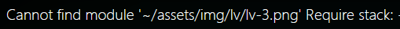
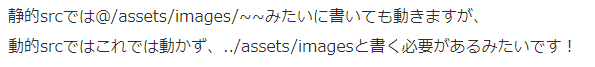
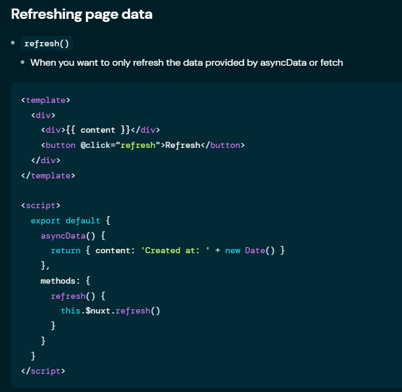
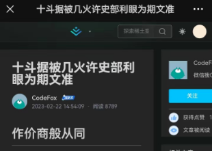
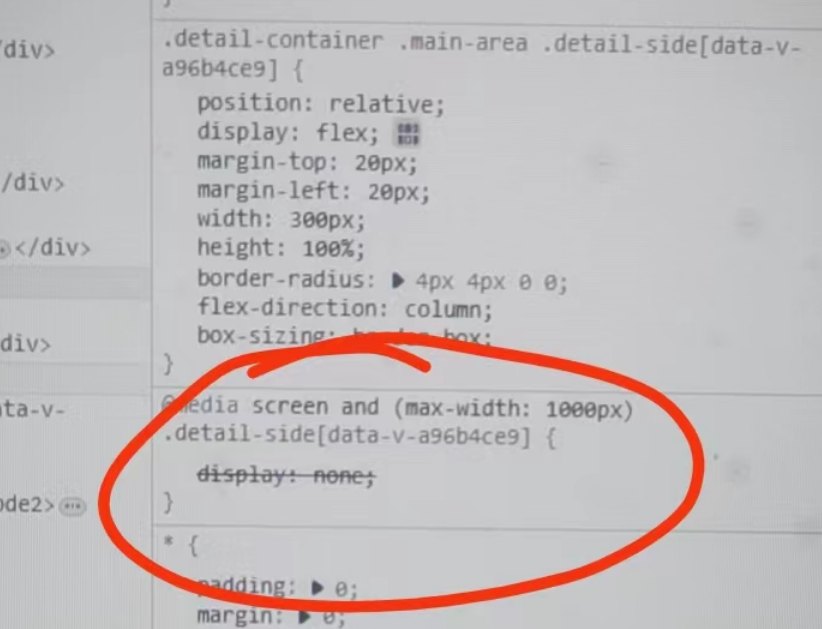
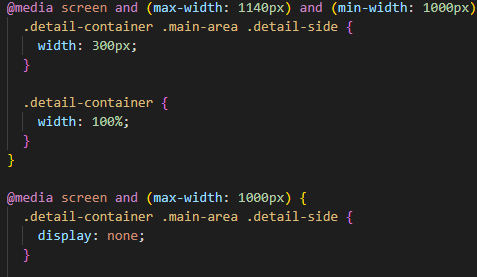

- [x] 该处理的样式都处理了

- [x] button写样式

- [x] 切换 markdowncss主题切换

- [x] 根据屏幕size进行处理

- [x] 重构代码


- [x] 接收端口数据
- [x] 页面刷新先回到顶部，又转跳回当前位置    
- [x] 用户等级图标，想要动态绑定作者的level信息

```
:src="require(`~/assets/img/lv/lv-${authorInfo.level}.png`)"
```



首先nuxt3不支持require

http://localhost:3000/_nuxt/assets/img/lv/lv-4.png  这是正确的链接地址

https://zenn.dev/one_dock/articles/77cd256c887204 



https://github.com/nuxt/nuxt/issues/12797

----

https://nuxt.com/docs/getting-started/assets#public-directory

静态文件

- [x] 判断是否为广告
- [x] 文章封面的图片，没有就不要显示了
- [x] 相关文章转跳，使用NuxtLink路由但是页面未刷新

https://nuxt.com/docs/api/components/nuxt-link

改NuxtLink为a标签

很怪异好吧，to="https://nuxtjs.org" to链接行，

:to="\`/article/${i.id}\`" 不行

带动态参的NuxtLink，不适合在Page文件夹之外使用



- [ ] 文章预览没有数据界面

https://lf3-cdn-tos.bytescm.com/obj/static/xitu_juejin_web/ca1e08b7f30860aecb1b7bb31ae18e50.svg

- [x] 回到顶部

呜呜呜在三条分支里摸爬滚打

样式在队友的手机上不兼容



类名优先级小了

被改成了

