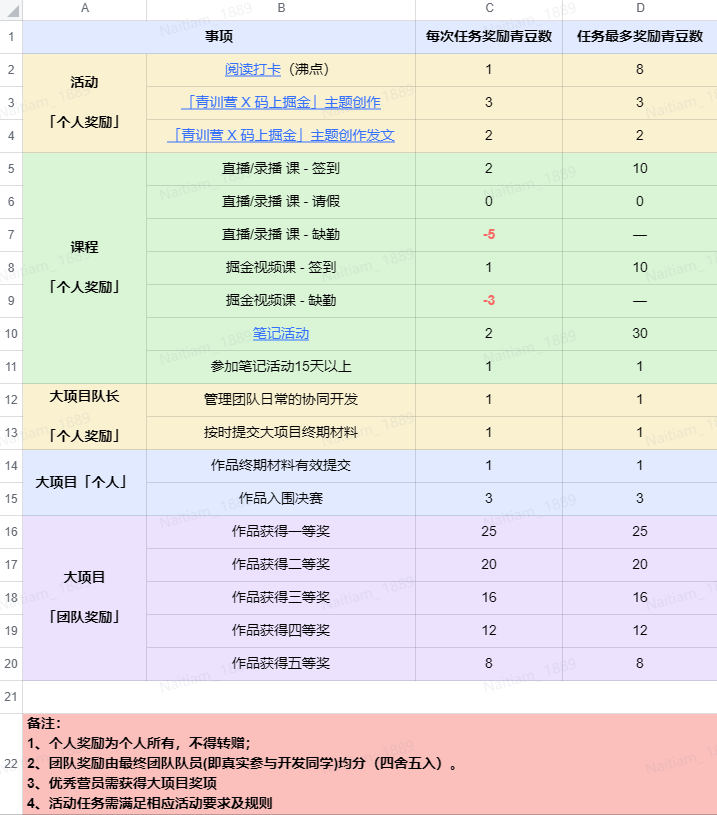

项目要求
https://bytedance.feishu.cn/docx/TKNwd1Ag5o5UI4xrqLLcXaW9nag
结营要65，优秀要>70，青豆规则https://bytedance.feishu.cn/docx/NBKEdyHhGoO4IJxmNz3c9vlenGd
总的规则
https://bytedance.feishu.cn/docx/TKNwd1Ag5o5UI4xrqLLcXaW9nag
阅读打卡要8天
https://juejin.cn/post/7174037539345399839
笔记活动2023年1月15日 - 2023年2月28日
代码创作 https://juejin.cn/post/7187753682421678137
遇见
canvas页面上浮动着小球点击就会聚集再鼠标点击处

希腊奶
css接口？怎么使用？主题化？白天黑夜？
https://blog.csdn.net/sinat_33488770/article/details/127415989?
ts报错处理？？是啥
代码规范？？？
文章目录咋写...

别人仿的掘金
https://juejin.cn/post/7135291360742998046
https://juejin.cn/post/6844904153697746957
https://juejin.cn/post/7134588862642257928
https://juejin.cn/post/6844904007069089805
https://juejin.cn/post/7133808368686202887

https://github.com/ChanWahFung/nuxt-juejin-project

关于在Vue使用mavonEditor组件，自制文章目录
https://blog.csdn.net/qq_45790967/article/details/122811937

nuxtjs讲解
https://juejin.cn/post/6844904066175205390

