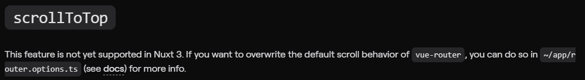
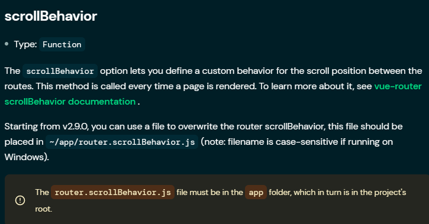
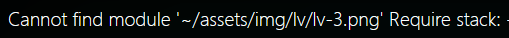
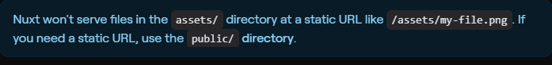

菜狗啊 要被沙爆啦

对 Nuxt3 不熟悉，官方文档看英文相当吃力，底力不足，学艺不精

不敢合并项目，担心修改冲突的时候搞坏代码

### 页面刷新或转跳后，页面停留在之前滚动位置

[History.scrollRestoration - Web API 接口参考 | MDN (mozilla.org)](https://developer.mozilla.org/zh-CN/docs/Web/API/History/scrollRestoration)

其实浏览器提供了原生的 API ，滚动后每次都回到顶部。

https://stackoverflow.com/questions/69902990/page-not-scrolling-to-top-when-route-changes-in-nuxt-js



The router property lets you customize Nuxt router. (vue-router ).

nuxt3表示还不支持回到顶部。



[Nuxt - The router Property (nuxtjs.org)](https://nuxtjs.org/docs/configuration-glossary/configuration-router#scrollbehavior)

*~/app/router.scrollBehavior.ts*

```
import type { RouterOptions } from '@nuxt/schema';

export default <RouterOptions>{
  scrollBehavior() {
    return { top: 0 };
  },
};
```

----

### 动态绑定作者的level图片

以往vue中绑定图片

```
:src="require(`~/assets/img/lv/lv-${authorInfo.level}.png`)"
```



nuxt3不支持require

```
:src="`~/assets/img/lv/lv-${authorInfo.level}.png`"
```

### 服务器上运行时图片无法显示，而且图片地址不正确

https://nuxt.com/docs/getting-started/assets#public-directory

**nuxt**使用`assests/`与`public/`目录来处理css样式，字体，图片等资产。

- `assests/`用于添加将由构建工具（Webpack或Vite）处理的所有网站资产。
- `public/`用于添加将由服务器提供的资产。



### Nuxt3中获取数据的方法

1. 数据获取的方法：useAsyncData ，useLazyAsyncData ，useFetch ，useLazyFetch（注意：他们只能在setup或者是生命周期钩子中使用）；
2. 跨组件状态共享 useState （useState 仅在 setup 和 生命周期钩子 中生效） ；
3. 访问运行时配置 useRuntimeConfig （useRuntimeConfig 仅在 setup函数 或 生命周期钩子 内有效）（注意：客户端和服务器端的行为是不同的）；

### 获取服务器的URL

https://nuxt.com/docs/api/composables/use-runtime-config

```
import { useRuntimeConfig } from '#imports';
const runtimeConfig = useRuntimeConfig();
```

```

```

----

### Nuxt3配置不同开发环境

https://blog.csdn.net/aizenmoxiguan/article/details/127527689

- 多个开发环境：根目录下创建env文件夹，文件夹中创建需要配置不同环境的.env.名字
- 单个开发环境：根目录下创建 .evn 文件

