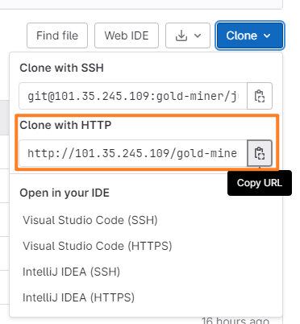

## 拉取项目

### 使用 ssh config 配置文件来管理 ssh 连接

在电脑上.ssh 文件夹中的 config 文件添加以下配置，没有就创建一个名为 config 的文件。

```Plain
  Host hostName的别名。
  HostName 是目标主机的主机名，也就是平时我们使用ssh后面跟的地址名称。
  User 指定的登陆用户名。
  Port 指定的端口号。
```

### 配置本地用户名和邮箱

查看当前的本地用户名和邮箱

`git config user.name`

`git config user.email`

重新配置本地的用户名和邮箱，会覆盖掉以前的

`git config --global user.name "用户名"`

`git config --global user.email "邮箱地址"`

查看配置是否成功

`git config --global --list`

### 公钥

生成公钥 `ssh-keygen -t rsa -C "邮箱地址"`

查看公钥 ` cat ~/.ssh/id_rsa.pub`

上传公钥到 gitlab


### 克隆代码到本地



` git clone 项目链接`

### 约定式提交

[约定式提交 (conventionalcommits.org)](https://www.conventionalcommits.org/zh-hans/v1.0.0/)

### 代码上传

三种分支代表啥含义?

- prod 分支: 基本没有问题的代码，是 feat 特性分支经过在 dev 上的多次测试后的没问题的代码。
- dev 分支:大家手.上各个 feat 特性分支在这里测试，都是从 feat 分支合入的。
- feat 分支:针对单独一个需求建立的，完成这个需求后被合入 prod，结束。

创建 fate 分支

`git check -b feat/story-xxx-xxx`

`git add.`

`git commit -m "feat：简述本次提交"`

`gti push origin feat分支名称`

分支被修改

> 别人传了分支我怎么拉取到

## 准备

`npm i -g pnpm`

`pnpm install`

运行`pnpm prepare`安装 git hook，用于在 commit 时使用 eslint 校验、prettier 格式化、commitlint 校验提交信息，校验不通过则无法提交。

安装插件


---

Expected linebreaks to be 'LF' but found 'CRLF'.

如果拉取代码后⾏尾红⾊波浪线报错，底下显⽰ CRLF 是 git 设置的问题，需要执⾏

`git config --global core.autocrlf false`

重新拉取代码 应该显⽰的是


```
git clone http://101.35.245.109/gold-miner/juejin.git  从prod克隆代码
git checkout dev
git checkout -b 新分支名
git checkout feat/story-105-about-article-directory
git pull origin feat/story-105-about-article-directory
git add .
git commit -m "feat：简述本次提交"
git push origin feat/story-105-about-article-directory
合到dev分支
git checkout dev
git pull origin dev
解决冲突
git merge feat/story-105-about-article-directory
git push origin dev
```
